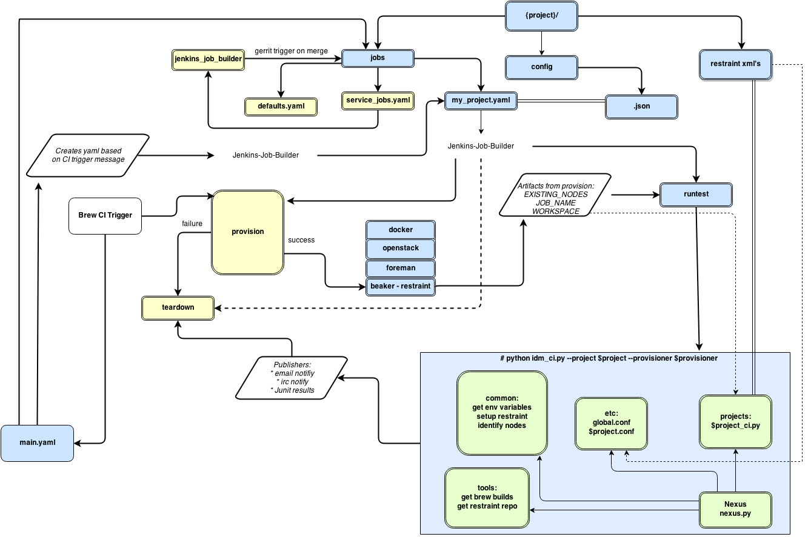

*"Learn to refactor, refactor to learn."*

I understand there are quite a few areas where the above applies, so if you are here 
please feel free to raise an issue with implementation details or pull requests are always welcome.

Note: The external visible behavior of nexus must remain the same.

Nexus - Continuous Integration utility
======================================

* _`Index`:

  * `Manual execution`_:

    - `Installing pre-requisities`_
    - `Setting environment variables`_
    - `Nexus configuration file`_
    - `Executing manually`_
  * `CI Workflow`_

Manual execution
================
Installing pre-requisities
==========================
* ssh into the machine where you intend to run Nexus

.. code-block:: bash

   ]# yum install -y python-setuptools autoconf gcc python-devel

   Download and install koji from
   http://koji.fedoraproject.org/koji/packageinfo?packageID=1181

   ]# git clone https://github.com/gsr-shanks/nexus.git
   ]# cd nexus
   ]# python setup.py install

   ]# python nexus/utils/restraint_repo_finder.py

   ]# yum install -y restraint restraint-client

Alternately you can download the rpm version of nexus at
https://mrniranjan.fedorapeople.org/

* yum install restraint-client

Setting environment variables
=============================
* export EXISTING_NODES=resource.hostname
* export JOB_NAME=jenkins_job_name
* export WORKSPACE=location_of_your_test_repo (in this example: /home/user)

Or update the jenkins section in your conf file.

Nexus configuration file
========================
* Sample file can be found at nexus/etc/nexus.ini

Executing manually
==================
* python nexus -h

.. code-block:: bash

    # nexus -h
    usage: nexus [-h] [--conf CONF] [--version] {brew,restraint,ci,git,errata} ...
    positional arguments:  {brew,restraint,ci,git,errata}
                                                git, brew, errata, restraint or ci

    optional arguments:
        -h, --help            show this help message and exit
        --conf CONF           configuration file
        --version             show version

CI Workflow
===========

